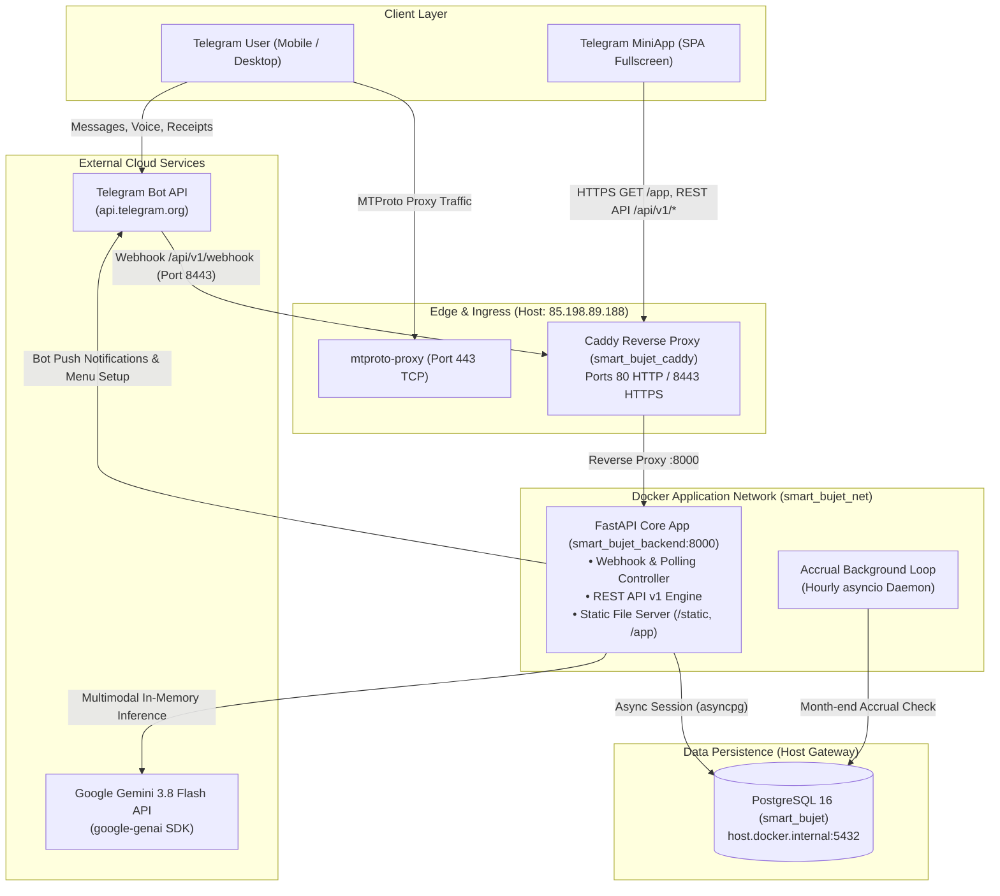
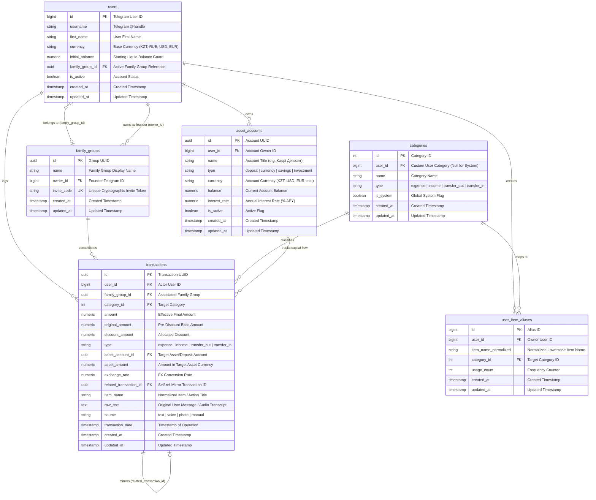
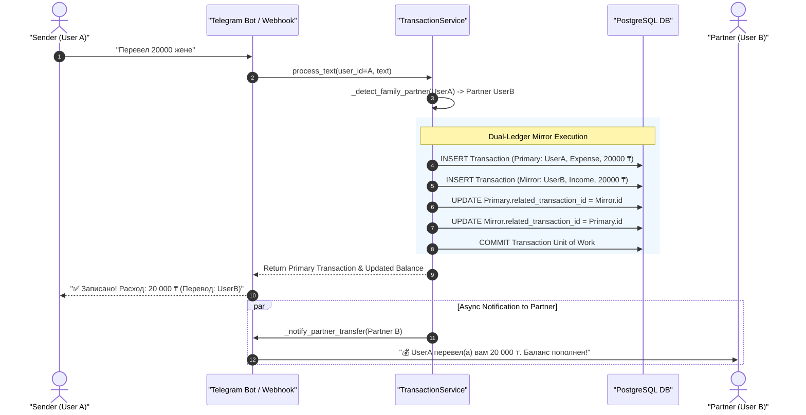
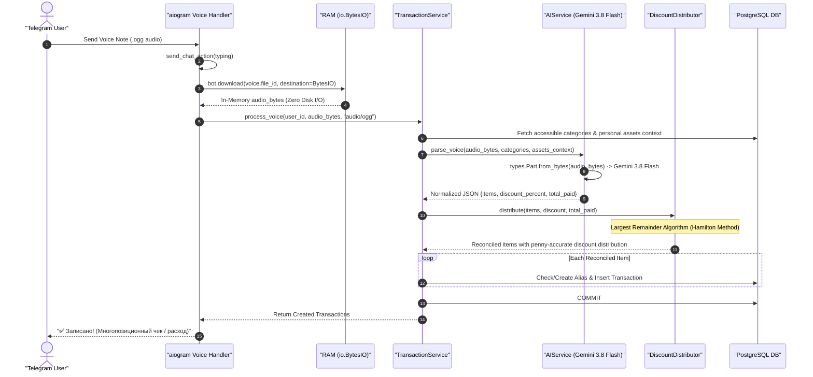
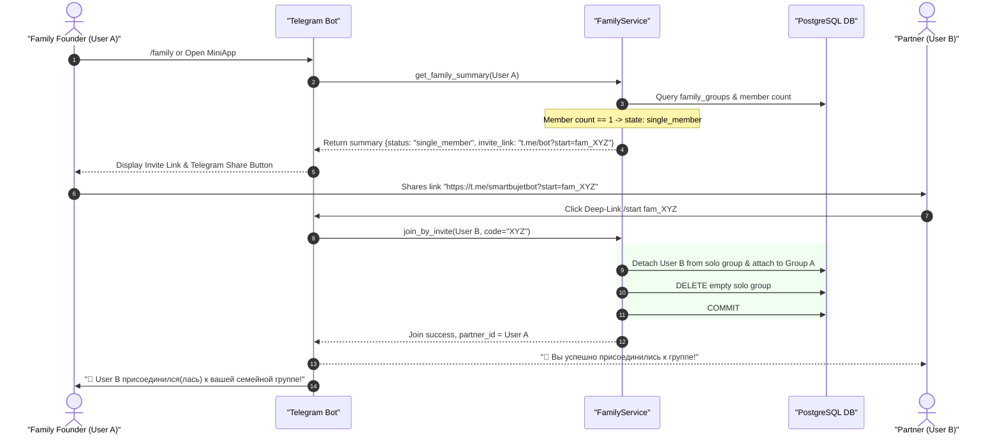

# Smart Bujet — System Architecture & Engineering Blueprint

> **Specification Version**: 2.4.0  
> **Status**: Production Deployed  
> **Target Audience**: Core Engineering Team, Lead System Analysts, DevOps  
> **Repository**: `https://github.com/AntonioKolosov/smart-bujet`  
> **Server Host**: `85.198.89.188`  
> **Telegram Bot**: `@smartbujetbot`  

---

## 1. Executive Summary & Topology

### 1.1 Overview
**Smart Bujet** is an intelligent personal and family financial management ecosystem powered by Google Gemini 3.8 Flash, FastAPI, aiogram 3, PostgreSQL 16, and a Telegram MiniApp. The system provides zero-friction transaction logging through multimodal user inputs (natural text, in-memory voice notes, and receipt photographs) combined with dual-ledger intra-family transfer mechanics, personal deposit tracking with automated compound interest accrual, and privacy-preserving shared accounting.

### 1.2 High-Level Architecture Topology
The diagram below illustrates the network boundaries, reverse proxy ingress, container isolation, and external service integrations.



---

## 2. Entity-Relationship Data Model & Schema

The database is built on **PostgreSQL 16** with asynchronous I/O via `asyncpg` and SQLAlchemy 2.0 ORM. All financial amounts utilize fixed-point `Numeric(12, 2)` or `Numeric(14, 2)` to eliminate IEEE 754 floating-point inaccuracies.

### 2.1 Entity Relationship Diagram



### 2.2 Schema Design Highlights
1. **Self-Referencing Transactions (`related_transaction_id`)**: Enables clean dual-ledger linking for intra-family transfers. When user A sends funds to partner B, two synchronized records are created and linked together with `ON DELETE SET NULL`.
2. **Deterministic Aliasing (`user_item_aliases`)**: Implements an LRU-like local cache (`uq_user_item_alias`) for frequent items (e.g., "хлеб" -> "Продукты"). Bypasses external AI calls in 10-15 ms.
3. **Compound Foreign Keys & Scoping**: `Category` items can be either system-wide (`user_id IS NULL`, `is_system = true`) or user-defined (`user_id = X`, `is_system = false`) with uniqueness scoped to `(user_id, name, type)`.

---

## 3. Core Architectural Sequence Diagrams

### 3.1 Intra-Family Transfer & Dual-Ledger Mirroring
Illustrates the transaction flow when a user sends funds to their partner (e.g., *"Перевел 20000 жене"*), ensuring zero combined balance change ($\Delta B_{\text{family}} = 0$) and instant partner notification.



### 3.2 In-Memory Multimodal Voice Processing Pipeline
Illustrates the zero-disk voice ingestion pipeline using direct streaming to Google Gemini 3.8 Flash.



### 3.3 Family Onboarding & Deep-Link Joining Flow
Illustrates the transition from a single-member state (`single_member`) to an active family state (`active_family`).



---

## 4. Complete REST API Endpoint Catalog (`/api/v1/*`)

All API routes require authentication via header `X-Telegram-Init-Data` validated against the bot token HMAC-SHA256 signature, except the Telegram Webhook callback.

### 4.1 Authentication & Profile (`/api/v1/auth`)
| Method | Endpoint | Description | Request Body / Params | Response |
| :--- | :--- | :--- | :--- | :--- |
| `POST` | `/api/v1/auth/validate` | Validates raw Telegram `initData` signature | `{"initData": "string"}` | `{"status": "ok", "valid": true, "user": {...}}` |
| `GET` | `/api/v1/auth/me` | Retrieves authenticated user profile & live balance | Header: `X-Telegram-Init-Data` | `UserMeResponse` (Balance, Month Metrics, Currency) |

### 4.2 Transactions (`/api/v1/transactions`)
| Method | Endpoint | Description | Request Body / Params | Response |
| :--- | :--- | :--- | :--- | :--- |
| `GET` | `/api/v1/transactions/` | Paginated transaction history for user or family | `include_family` (bool), `limit` (int), `offset` (int) | `List[TransactionRead]` |
| `POST` | `/api/v1/transactions/` | Creates a manual transaction | `TransactionCreate` payload | `TransactionRead` |

### 4.3 Asset Accounts & Deposits (`/api/v1/assets`)
| Method | Endpoint | Description | Request Body / Params | Response |
| :--- | :--- | :--- | :--- | :--- |
| `GET` | `/api/v1/assets/` | Lists user's strictly personal active asset accounts | None | `List[AssetAccount]` |
| `GET` | `/api/v1/assets/summary` | Net Worth breakdown (liquid vs locked assets in base currency) | None | `PortfolioSummary` (Total deposits, currencies, net worth) |
| `POST` | `/api/v1/assets/` | Creates a new deposit, savings, or foreign currency account | `CreateAssetRequest` (`name`, `type`, `currency`, `balance`, `rate`) | `{"status": "ok", "asset": {...}}` |
| `POST` | `/api/v1/assets/{id}/deposit` | Deposits funds from liquid balance into asset account | `{"amount": float, "note": str}` | `{"status": "ok", "balance": float}` |
| `POST` | `/api/v1/assets/{id}/withdraw` | Withdraws funds from asset account back to liquid balance | `{"amount": float, "note": str}` | `{"status": "ok", "balance": float}` |
| `POST` | `/api/v1/assets/accrue-interest` | Triggers manual month-end interest calculation | None | `{"status": "ok", "accrued_count": int, "transactions": [...]}` |

### 4.4 Family Group Management (`/api/v1/family`)
| Method | Endpoint | Description | Request Body / Params | Response |
| :--- | :--- | :--- | :--- | :--- |
| `GET` | `/api/v1/family/summary` | Consolidated family balances with intercompany elimination | None | `FamilySummaryResponse` (state, combined metrics, members) |
| `GET` | `/api/v1/family/transactions` | Joint feed of family transactions with privacy masking | `limit` (int, default 60), `offset` (int) | `List[FamilyTransactionItem]` |
| `POST` | `/api/v1/family/join` | Joins a family group via invite code | `{"invite_code": "string"}` | `{"success": true, "group_name": "string"}` |
| `POST` | `/api/v1/family/leave` | Leaves current family group and notifies partner | None | `{"success": true}` |

### 4.5 Categories & Analytics (`/api/v1/categories`, `/api/v1/analytics`)
| Method | Endpoint | Description | Request Body / Params | Response |
| :--- | :--- | :--- | :--- | :--- |
| `GET` | `/api/v1/categories/` | Lists system and user categories | `type` (`income` \| `expense` \| `transfer_out` \| `transfer_in`) | `List[CategoryRead]` |
| `POST` | `/api/v1/categories/` | Creates a custom user category | `CategoryCreate` payload | `CategoryRead` |
| `GET` | `/api/v1/analytics/report` | Financial summary and category breakdown | `period` (`week` \| `month` \| `year`), `include_family` (bool) | `ReportResponse` |

### 4.6 Webhook (`/api/v1/webhook`)
| Method | Endpoint | Description | Request Body / Params | Response |
| :--- | :--- | :--- | :--- | :--- |
| `POST` | `/api/v1/webhook` | Telegram Bot API Webhook Ingress | Header: `X-Telegram-Bot-Api-Secret-Token` | `{"status": "ok"}` |

---

## 5. Service Layer Specifications & Business Rules

```
src/services/
├── ai_service.py           # Gemini 3.8 Flash multimodal integration
├── asset_service.py        # Personal asset accounts & monthly compound interest
├── category_service.py     # System seeding & custom category management
├── discount_service.py     # Largest Remainder Method (Hamilton Algorithm)
├── family_service.py       # Family state management & privacy masking
├── parser_service.py       # Regex parsing & normalized casing heuristics
├── report_service.py       # Financial aggregation & category breakdown
└── transaction_service.py  # Central transaction orchestrator & mirror transfers
```

### 5.1 Financial Invariants & Business Logic

#### Invariant 1: Intra-Family Mirror Preservation ($\Delta B_{\text{family}} \equiv 0$)
When User A records an expense transfer to their family partner B:
$$\Delta B_A = -X, \quad \Delta B_B = +X \implies \Delta B_{\text{family}} = \Delta B_A + \Delta B_B = 0$$
The family combined balance remains strictly constant.

#### Invariant 2: Intercompany Elimination in Consolidated Family Cash Flow
Intra-family transfers do not represent external household expenses or revenues. The family summary excludes transactions where `related_transaction_id IS NOT NULL`:
$$E_{\text{consolidated}} = \sum_{m \in \text{members}} E_m - \sum \text{IntraFamilyTransfers}$$
$$I_{\text{consolidated}} = \sum_{m \in \text{members}} I_m - \sum \text{IntraFamilyTransfers}$$

#### Invariant 3: Deterministic Discount Distribution (Largest Remainder Method)
Given line items $A_1, A_2, \dots, A_n$ and total discount $D$, each item receives an exact discount $d_i = D \times \frac{A_i}{\sum A_k}$. Unallocated cents $C = \left(D - \sum \lfloor d_i \rfloor\right) \times 100$ are distributed one cent at a time to items with the largest fractional remainders $r_i = d_i - \lfloor d_i \rfloor$. This guarantees:
$$\sum_{i=1}^n (A_i - d_i^*) = \sum A_i - D = \text{total\_paid}$$

#### Invariant 4: Monthly Interest Compound Accrual Idempotency
Monthly interest on deposit accounts is calculated as:
$$I_{\text{month}} = \left\lfloor \text{balance} \times \frac{\text{interest\_rate}}{100 \times 12} \times 100 + 0.5 \right\rfloor \div 100$$
The execution engine checks for an existing transaction matching `(asset_account_id, category_id, start_of_month <= tx_date < end_of_month)` before applying the accrual, guaranteeing zero duplicate accruals even across arbitrary scheduler restarts.

#### Invariant 5: Personal Isolation & Privacy Masking
1. **Asset Isolation**: `AssetService.get_user_assets()` filters strictly by `user_id`. No user can inspect or operate on another user's deposit or currency balances.
2. **Feed Masking**: In shared family feeds (`FamilyService.get_family_transactions()`), any operation touching an `asset_account_id` or matching deposit keywords is renamed to `"Пополнение депозита"`, `"Снятие с депозита"`, or `"Проценты по вкладу"`, and `raw_text` is set to `None` to prevent leaking private purchase memos or voice prompts.

---

## 6. Deployment & DevOps Architecture

### 6.1 Container Topology & Port Isolation

| Container | Image | Host Port | Internal Port | Memory Limit | CPU Limit | Purpose |
| :--- | :--- | :--- | :--- | :--- | :--- | :--- |
| `smart_bujet_caddy` | `caddy:2-alpine` | `80`, `8443` | `80`, `443` | 64 MB | 0.20 | Reverse proxy & TLS termination |
| `smart_bujet_backend` | `smart-bujet-backend:latest` | None | `8000` | 240 MB | 0.40 | FastAPI + aiogram 3 backend |
| *Host Process* | `nineseconds/mtg:2` | `443` | `443` | - | - | **MTProto Telegram Proxy (Protected)** |
| *Host Process* | `postgres:16` | `5432` | `5432` | - | - | PostgreSQL 16 Database Server |

> [!IMPORTANT]
> **MTProto Port 443 Isolation Guard**: The host runs an active MTProto proxy on standard port `443`. To prevent port collision, `smart_bujet_caddy` is mapped to **`8443:443`** for HTTPS/Webhook traffic and **`80:80`** for HTTP. Port 443 on the host remains completely untouched and dedicated to MTProto.

### 6.2 Caddyfile Ingress Routing
```caddy
{
    http_port 80
    https_port 443
}

85.198.89.188.sslip.io {
    reverse_proxy backend:8000
}

:80 {
    reverse_proxy backend:8000
}

:443 {
    tls internal
    reverse_proxy backend:8000
}
```

### 6.3 GitHub Actions CI/CD Pipeline
Continuous deployment is configured in `.github/workflows/deploy.yml`:
1. **Lint & Syntax Verification**: Triggers on push to `main`, compiling all Python code with `python -m py_compile`.
2. **Automated SSH Deployment**: Connects to `85.198.89.188` via SSH ed25519 key, pulls latest Git revisions, builds Docker images, and executes `docker compose up -d --build` followed by image pruning.

---

## 7. Developer Handover & Operational Runbook

### 7.1 Project Directory Structure
```
C:\Users\aanto\smart-bujet\
├── .github/workflows/deploy.yml  # CI/CD deployment pipeline
├── Caddyfile                     # Caddy reverse proxy routing rules
├── Dockerfile                    # Multistage Python 3.12-slim build
├── docker-compose.yml            # Container definitions & resource limits
├── pyproject.toml                # Project metadata & Python dependencies
├── alembic.ini                   # Alembic database migration config
├── migrations/                   # Alembic migration environment
├── scripts/                      # Operational & verification scripts
│   ├── init_db.py                # Database table creation & default category seeding
│   ├── init_db_roles.sql         # Read-only role provisioning script
│   ├── reset_family_flow.py      # Resets family group to solo state for onboarding QA
│   ├── test_privacy_and_isolation.py # Automated test verifying isolation & masking
│   └── run_reports.py            # CLI script to generate & dispatch periodic reports
└── src/
    ├── main.py                   # FastAPI application lifespan & entry point
    ├── api/                      # REST API routes and dependencies
    ├── bot/                      # aiogram 3 bot routers, handlers, and keyboards
    ├── core/                     # Configuration, database engine, security, scheduler
    ├── models/                   # SQLAlchemy declarative data models
    ├── schemas/                  # Pydantic validation & response schemas
    ├── services/                 # Core domain business logic services
    └── static/                   # Telegram MiniApp SPA (HTML, CSS, JS)
```

### 7.2 Execution & Development Commands

#### Local Environment Setup
```bash
# 1. Create and activate virtual environment
python -m venv .venv
source .venv/bin/activate  # On Windows: .venv\Scripts\Activate.ps1

# 2. Install dependencies
pip install -e .

# 3. Copy environment configuration
cp .env.example .env
```

#### Running Database Initialization & Verification Scripts
```bash
# Initialize tables and seed default categories
python -m scripts.init_db

# Run automated privacy and isolation audit
python -m scripts.test_privacy_and_isolation

# Reset family group to single_member mode for onboarding testing
python -m scripts.reset_family_flow

# Generate and send weekly report
python -m scripts.run_reports --period week
```

#### Starting Application Locally
```bash
uvicorn src.main:app --host 0.0.0.0 --port 8000 --reload
```

#### Docker Deployment (Production)
```bash
# Build and start services in background
docker compose up -d --build

# View container logs
docker compose logs -f backend
docker compose logs -f caddy
```

---

*Architectural Blueprint approved and certified for GitHub repository documentation.*
