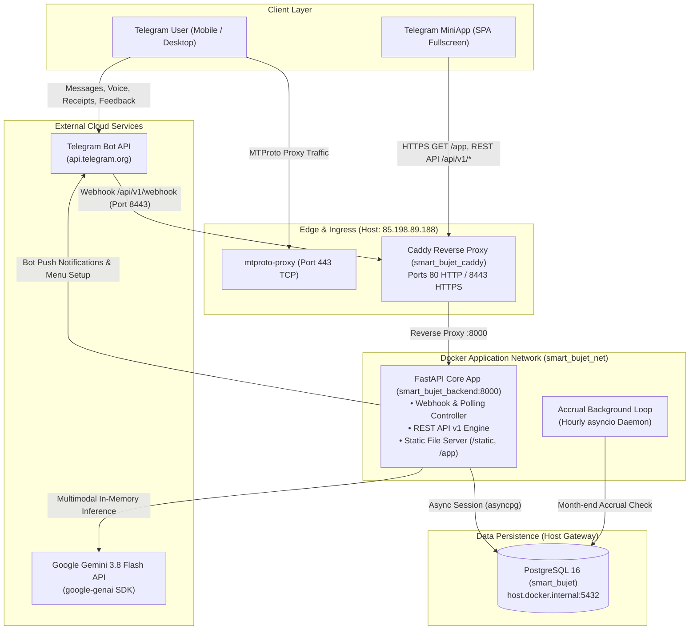
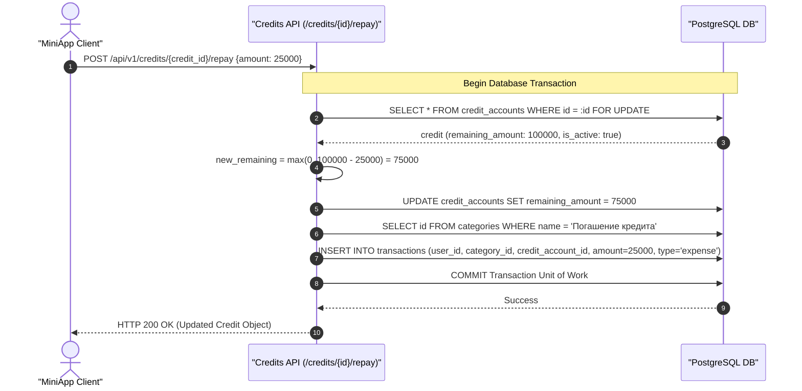
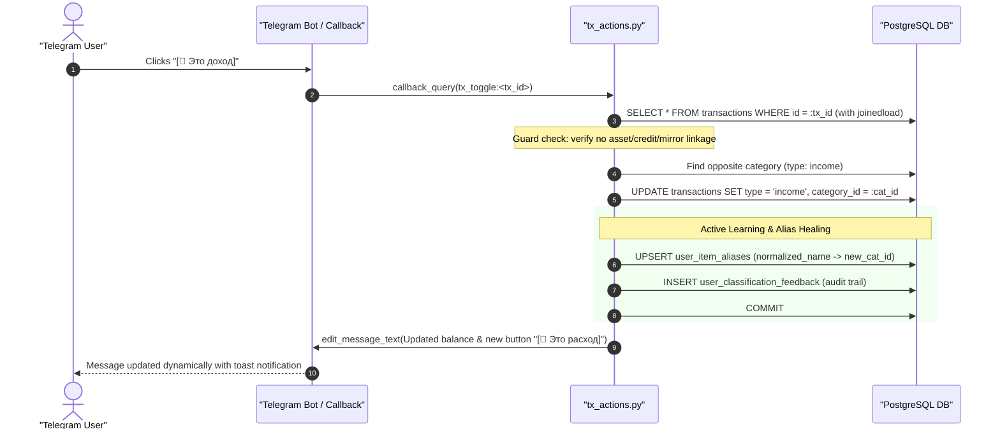
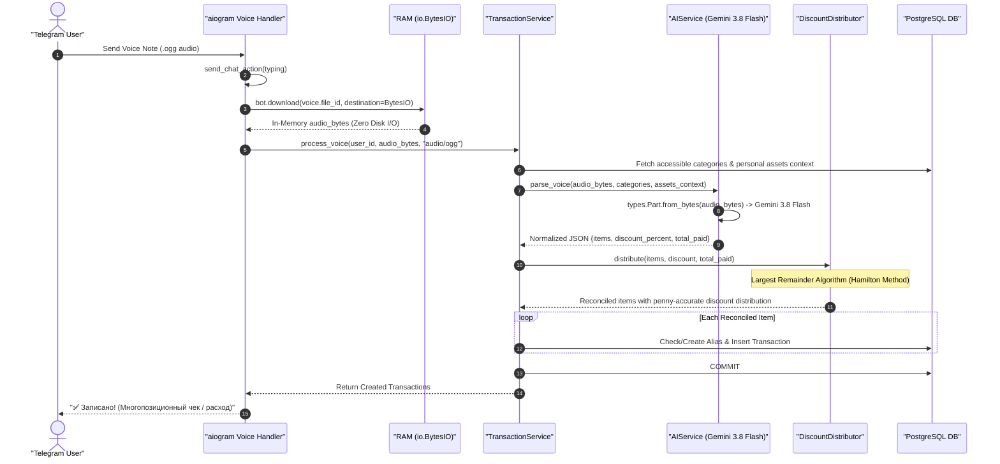
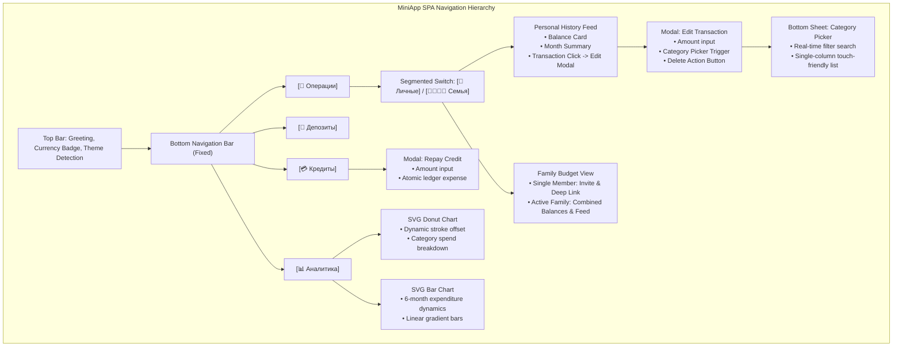

# Smart Bujet — System Architecture & Engineering Blueprint

> **Specification Version**: 2.5.0  
> **Status**: Production Deployed & Hardened  
> **Target Audience**: Core Engineering Team, Lead System Analysts, DevOps  
> **Repository**: `https://github.com/AntonioKolosov/smart-bujet`  
> **Server Host**: `85.198.89.188`  
> **Telegram Bot**: `@smartbujetbot`  

---

## 1. Executive Summary & Topology

### 1.1 Overview
**Smart Bujet** is an intelligent personal and family financial management ecosystem powered by Google Gemini 3.8 Flash, FastAPI, aiogram 3, PostgreSQL 16, and a Telegram MiniApp. The system provides zero-friction transaction logging through multimodal inputs (natural text, in-memory voice notes, and receipt photographs) combined with dual-ledger intra-family transfer mechanics, personal deposit tracking with automated compound interest accrual, credit and liability management, interactive bot feedback with dynamic few-shot learning, and privacy-preserving shared accounting.

### 1.2 High-Level Architecture Topology



---

## 2. Entity-Relationship Data Model & Schema

The database is built on **PostgreSQL 16** with asynchronous I/O via `asyncpg` and SQLAlchemy 2.0 ORM. All financial amounts utilize fixed-point `Numeric(12, 2)` or `Numeric(14, 2)` to eliminate IEEE 754 floating-point inaccuracies.

### 2.1 Entity Relationship Diagram

```mermaid
erDiagram
    users ||--o{ transactions : "logs"
    users ||--o{ asset_accounts : "owns"
    users ||--o{ credit_accounts : "incurs"
    users ||--o{ user_item_aliases : "creates"
    users ||--o{ user_classification_feedback : "submits"
    users }o--o| family_groups : "belongs to (family_group_id)"
    users ||--o{ family_groups : "owns as founder (owner_id)"

    family_groups ||--o{ transactions : "consolidates"

    categories ||--o{ transactions : "classifies"
    categories ||--o{ user_item_aliases : "maps to"

    asset_accounts ||--o{ transactions : "tracks capital flow"
    credit_accounts ||--o{ transactions : "tracks repayments"

    transactions ||--o| transactions : "mirrors (related_transaction_id)"

    users {
        bigint id PK "Telegram User ID"
        string username "Telegram @handle"
        string first_name "User First Name"
        string currency "Base Currency (KZT, RUB, USD, EUR)"
        numeric initial_balance "Starting Liquid Balance Guard"
        uuid family_group_id FK "Active Family Group Reference"
        boolean is_active "Account Status"
        timestamp created_at "Created Timestamp"
        timestamp updated_at "Updated Timestamp"
    }

    family_groups {
        uuid id PK "Group UUID"
        string name "Family Group Display Name"
        bigint owner_id FK "Founder Telegram ID"
        string invite_code UK "Unique Cryptographic Invite Token"
        timestamp created_at "Created Timestamp"
        timestamp updated_at "Updated Timestamp"
    }

    asset_accounts {
        uuid id PK "Account UUID"
        bigint user_id FK "Account Owner ID"
        string name "Account Title (e.g. Kaspi Депозит)"
        string type "deposit | currency | savings | investment"
        string currency "Account Currency (KZT, USD, EUR, etc.)"
        numeric balance "Current Account Balance"
        numeric interest_rate "Annual Interest Rate (% APY)"
        boolean is_active "Active Flag"
        timestamp created_at "Created Timestamp"
        timestamp updated_at "Updated Timestamp"
    }

    credit_accounts {
        uuid id PK "Credit UUID"
        bigint user_id FK "Borrower User ID"
        string name "Credit Title (e.g. Автокредит)"
        string bank_name "Bank / Creditor Name"
        numeric original_amount "Initial Principal Liability"
        numeric remaining_amount "Current Outstanding Principal"
        string currency "Credit Currency (KZT, USD, etc.)"
        numeric interest_rate "Annual Interest Rate (% APR)"
        numeric monthly_payment "Scheduled Monthly Payment"
        boolean is_active "Active Debt Flag"
        timestamp closed_at "Date Fully Paid Off"
        timestamp created_at "Created Timestamp"
        timestamp updated_at "Updated Timestamp"
    }

    categories {
        int id PK "Category ID"
        bigint user_id FK "Custom User Category (Null for System)"
        string name "Category Name"
        string type "expense | income | transfer_out | transfer_in"
        boolean is_system "Global System Flag"
        timestamp created_at "Created Timestamp"
        timestamp updated_at "Updated Timestamp"
    }

    user_item_aliases {
        bigint id PK "Alias ID"
        bigint user_id FK "Owner User ID"
        string item_name_normalized "Normalized Lowercase Item Name"
        int category_id FK "Target Category ID"
        int usage_count "Frequency Counter"
        timestamp created_at "Created Timestamp"
        timestamp updated_at "Updated Timestamp"
    }

    dynamic_few_shots {
        uuid id PK "Few-Shot UUID"
        string domain_tag "Domain (debt, transfer, food, repair, shopping, misc)"
        string raw_query "Benchmark User Input"
        json expected_payload "Canonical LLM Parsing Output"
        int priority "Retrieval Weight"
        boolean is_active "Active Flag"
        timestamp created_at "Created Timestamp"
        timestamp updated_at "Updated Timestamp"
    }

    user_classification_feedback {
        uuid id PK "Feedback UUID"
        bigint user_id FK "Actor User ID"
        uuid transaction_id FK "Target Transaction ID"
        text original_text "Original User Query"
        string original_type "Pre-flip Type"
        string corrected_type "Post-flip Type"
        int original_category_id FK "Pre-flip Category ID"
        int corrected_category_id FK "Post-flip Category ID"
        timestamp created_at "Created Timestamp"
        timestamp updated_at "Updated Timestamp"
    }

    transactions {
        uuid id PK "Transaction UUID"
        bigint user_id FK "Actor User ID"
        uuid family_group_id FK "Associated Family Group"
        int category_id FK "Target Category"
        numeric amount "Effective Final Amount"
        numeric original_amount "Pre-Discount Base Amount"
        numeric discount_amount "Allocated Discount"
        string type "expense | income | transfer_out | transfer_in"
        uuid asset_account_id FK "Target Asset Account"
        numeric asset_amount "Amount in Target Asset Currency"
        numeric exchange_rate "FX Conversion Rate"
        uuid related_transaction_id FK "Self-ref Mirror Transaction ID"
        uuid credit_account_id FK "Linked Credit / Loan Account"
        string item_name "Normalized Item / Action Title"
        text raw_text "Original User Message / Audio Transcript"
        string source "text | voice | photo | manual"
        timestamp transaction_date "Timestamp of Operation"
        timestamp created_at "Created Timestamp"
        timestamp updated_at "Updated Timestamp"
    }
```



### 2.2 Schema Design Highlights
1. **Self-Referencing Transactions (`related_transaction_id`)**: Enables clean dual-ledger linking for intra-family transfers. When user A sends funds to partner B, two synchronized records are created and linked together with `ON DELETE SET NULL`.
2. **Dedicated Credit Management (`credit_accounts` & `credit_account_id`)**: Explicitly separates liabilities from assets. Expense transactions with `credit_account_id` record repayments, adjusting remaining debt atomically with pessimistic row-locking (`with_for_update`).
3. **Deterministic Aliasing & Active Learning (`user_item_aliases`, `user_classification_feedback`)**: High-speed local cache for frequent items (bypasses LLM in 10-15 ms) paired with audit logs of user classification overrides (`[🔄 Это доход]` / `[🔄 Это расход]`).
4. **Dynamic Context Few-Shots (`dynamic_few_shots`)**: Extensible repository of canonical financial interpretations injected into LLM system prompts without code re-deployment.

---

## 3. Core Architectural Sequence Diagrams

### 3.1 Credit Repayment via MiniApp with Pessimistic Locking
Illustrates the atomic execution of debt reduction and ledger expense creation under pessimistic row locking (`with_for_update`).



### 3.2 Transaction Deletion & Full ACID Ledger Rollback
Illustrates how deleting a transaction reverses all associated balances, restores liabilities, and safely removes intra-family mirror pairs.

```mermaid
sequenceDiagram
    autonumber
    actor User as "User (MiniApp)"
    participant API as "Transactions API"
    participant TS as "TransactionService"
    participant DB as "PostgreSQL DB"

    User->>API: DELETE /api/v1/transactions/{tx_id}
    API->>TS: delete_transaction(user_id, tx_id)
    
    rect rgb(255, 245, 245)
        Note over TS,DB: ACID Ledger Rollback
        TS->>DB: SELECT * FROM transactions WHERE id = :id FOR UPDATE
        DB-->>TS: Transaction tx
        
        opt Linked to AssetAccount
            TS->>DB: SELECT * FROM asset_accounts WHERE id = tx.asset_account_id FOR UPDATE
            TS->>DB: Reverse asset balance adjustment (transfer_out / transfer_in / interest)
        end

        opt Linked to CreditAccount
            TS->>DB: SELECT * FROM credit_accounts WHERE id = tx.credit_account_id FOR UPDATE
            TS->>DB: Restore remaining_amount (remaining += tx.amount; is_active = true)
        end

        opt Has Intra-Family Mirror (related_transaction_id)
            TS->>DB: SELECT * FROM transactions WHERE id = tx.related_transaction_id FOR UPDATE
            TS->>DB: UPDATE Primary.related_transaction_id = NULL, Mirror.related_transaction_id = NULL
            TS->>DB: DELETE FROM transactions WHERE id = mirror_tx.id
        end

        TS->>DB: DELETE FROM transactions WHERE id = tx.id
        TS->>DB: COMMIT
    end

    TS-->>API: Success
    API-->>User: HTTP 204 No Content
```

### 3.3 Dynamic Bot Feedback & Active Learning Loop
Illustrates real-time classification healing when a user toggles transaction polarity via Telegram inline buttons.



### 3.4 In-Memory Multimodal Voice Processing Pipeline
Illustrates the zero-disk voice ingestion pipeline using direct streaming to Google Gemini 3.8 Flash.



---

## 4. Complete REST API Endpoint Catalog (`/api/v1/*`)

All API routes require authentication via header `X-Telegram-Init-Data` validated against the bot token HMAC-SHA256 signature, except the Telegram Webhook callback.

### 4.1 Authentication & Profile (`/api/v1/auth`)
| Method | Endpoint | Description | Request Body / Params | Response |
| :--- | :--- | :--- | :--- | :--- |
| `POST` | `/api/v1/auth/validate` | Validates raw Telegram `initData` signature | `{"initData": "string"}` | `{"status": "ok", "valid": true, "user": {...}}` |
| `GET` | `/api/v1/auth/me` | Retrieves authenticated user profile & live balance | Header: `X-Telegram-Init-Data` | `UserMeResponse` (Balance, Month Metrics, Currency) |

### 4.2 Transactions (`/api/v1/transactions`)
| Method | Endpoint | Description | Request Body / Params | Response |
| :--- | :--- | :--- | :--- | :--- |
| `GET` | `/api/v1/transactions/` | Paginated transaction history with unified privacy masking | `include_family` (bool), `limit` (int), `offset` (int) | `List[TransactionRead]` |
| `POST` | `/api/v1/transactions/` | Creates a manual transaction with business validations | `TransactionCreate` payload (`amount > 0`, `category_id`) | `TransactionRead` |
| `PATCH`| `/api/v1/transactions/{id}` | Edits transaction amount, category, or title with ledger sync | `TransactionUpdate` payload | `TransactionRead` |
| `DELETE`| `/api/v1/transactions/{id}`| Deletes transaction with full ACID ledger rollback | Path: `id` (UUID) | HTTP 204 No Content |

### 4.3 Credits & Liabilities (`/api/v1/credits`)
| Method | Endpoint | Description | Request Body / Params | Response |
| :--- | :--- | :--- | :--- | :--- |
| `GET` | `/api/v1/credits/` | Lists current user's active/all personal credit accounts | `active_only` (bool, default false) | `List[CreditAccountRead]` |
| `GET` | `/api/v1/credits/summary` | Total liabilities, monthly commitments, and debt breakdown | None | `CreditSummaryResponse` |
| `POST` | `/api/v1/credits/` | Creates a new personal loan/credit liability | `CreditAccountCreate` payload | `CreditAccountRead` |
| `POST` | `/api/v1/credits/{id}/repay` | Repays debt and atomically records ledger expense | `CreditAccountRepay` (`amount > 0`) | `CreditAccountRead` |
| `DELETE`| `/api/v1/credits/{id}` | Deletes or archives a credit account | Path: `id` (UUID) | HTTP 204 No Content |

### 4.4 Analytics (`/api/v1/analytics`)
| Method | Endpoint | Description | Request Body / Params | Response |
| :--- | :--- | :--- | :--- | :--- |
| `GET` | `/api/v1/analytics/report` | Financial summary and category totals for period | `period` (`week`, `month`, `year`), `include_family` (bool) | `ReportResponse` |
| `GET` | `/api/v1/analytics/categories` | Calendar-month category spending breakdown with UI metadata | `family` (bool), `period` (`month`, `year`) | `CategoryAnalyticsResponse` |
| `GET` | `/api/v1/analytics/monthly` | 6-month historical spending and income dynamics | `family` (bool), `months` (int, 1–24) | `MonthlyAnalyticsResponse` |

### 4.5 Asset Accounts & Deposits (`/api/v1/assets`)
| Method | Endpoint | Description | Request Body / Params | Response |
| :--- | :--- | :--- | :--- | :--- |
| `GET` | `/api/v1/assets/` | Lists user's strictly personal active asset accounts | None | `List[AssetAccount]` |
| `GET` | `/api/v1/assets/summary` | Net Worth breakdown (liquid vs locked assets in base currency) | None | `PortfolioSummary` |
| `POST` | `/api/v1/assets/` | Creates a new deposit, savings, or foreign currency account | `CreateAssetRequest` payload | `{"status": "ok", "asset": {...}}` |
| `POST` | `/api/v1/assets/{id}/deposit` | Deposits funds from liquid balance into asset account | `{"amount": float, "note": str}` | `{"status": "ok", "balance": float}` |
| `POST` | `/api/v1/assets/{id}/withdraw` | Withdraws funds from asset account back to liquid balance | `{"amount": float, "note": str}` | `{"status": "ok", "balance": float}` |
| `POST` | `/api/v1/assets/accrue-interest` | Triggers manual month-end interest calculation | None | `{"status": "ok", "accrued_count": int}` |

### 4.6 Family Group Management (`/api/v1/family`)
| Method | Endpoint | Description | Request Body / Params | Response |
| :--- | :--- | :--- | :--- | :--- |
| `GET` | `/api/v1/family/summary` | Consolidated family balances with intercompany elimination | None | `FamilySummaryResponse` |
| `GET` | `/api/v1/family/transactions` | Joint feed of family transactions with privacy masking | `limit` (int, default 60), `offset` (int) | `List[FamilyTransactionItem]` |
| `POST` | `/api/v1/family/join` | Joins a family group via invite code | `{"invite_code": "string"}` | `{"success": true, "group_name": "string"}` |
| `POST` | `/api/v1/family/leave` | Leaves current family group and notifies partner | None | `{"success": true}` |

### 4.7 Categories (`/api/v1/categories`)
| Method | Endpoint | Description | Request Body / Params | Response |
| :--- | :--- | :--- | :--- | :--- |
| `GET` | `/api/v1/categories/` | Lists system and user categories | `type` (`income` \| `expense` \| `transfer_out` \| `transfer_in`) | `List[CategoryRead]` |
| `POST` | `/api/v1/categories/` | Creates a custom user category | `CategoryCreate` payload | `CategoryRead` |

### 4.8 Webhook (`/api/v1/webhook`)
| Method | Endpoint | Description | Request Body / Params | Response |
| :--- | :--- | :--- | :--- | :--- |
| `POST` | `/api/v1/webhook` | Telegram Bot API Webhook Ingress (constant-time validation) | Header: `X-Telegram-Bot-Api-Secret-Token` | `{"status": "ok"}` |

---

## 5. Service Layer Specifications & Business Rules

```
src/services/
├── ai_service.py              # Gemini 3.8 Flash multimodal parsing & restaurant aggregation
├── asset_service.py           # Personal assets & monthly compound interest accrual
├── category_service.py        # System seeding & custom category taxonomy
├── credit_service.py          # Credit lifecycle, debt summary & heuristic resolution
├── discount_service.py        # Hamilton Largest Remainder discount distribution
├── dynamic_context_service.py # Few-shot retrieval, prompt injection & alias sanitization
├── family_service.py          # Family state, onboarding deep links & intercompany elimination
├── parser_service.py          # Heuristic regex parsing
├── report_service.py          # Donut & Bar chart analytics aggregations
└── transaction_service.py     # Central orchestrator, CRUD lifecycle, ACID rollback & privacy masking
```

### 5.1 Financial Invariants & Integrity Rules

#### Invariant 1: Intra-Family Mirror Preservation ($\Delta B_{\text{family}} \equiv 0$)
When User A records an expense transfer to their family partner B:
$$\Delta B_A = -X, \quad \Delta B_B = +X \implies \Delta B_{\text{family}} = \Delta B_A + \Delta B_B = 0$$
Toggling transaction type on linked transactions is strictly prohibited by security guards in `tx_actions.py`.

#### Invariant 2: Intercompany Cashflow Elimination
Intra-family transfers are excluded from external family revenues and expenditures. Consolidated monthly income accounts only for external inflows:
$$E_{\text{consolidated}} = \max\left(0, \sum E_m - \text{IntraTransfers}\right), \quad I_{\text{consolidated}} = \max\left(0, \sum I_{\text{external}}\right)$$

#### Invariant 3: Credit Repayment Atomicity
A credit repayment must simultaneously decrease the outstanding liability and record an equal cash expense in the ledger within a single database transaction boundary:
$$\Delta L_{\text{credit}} = -X, \quad \Delta B_{\text{liquid}} = -X$$

#### Invariant 4: Transaction Deletion Balance Conservation
Deleting a transaction strictly reverses its financial effects:
- **Deposit Top-up**: Asset balance decreases by $X$.
- **Deposit Withdrawal**: Asset balance increases by $X$.
- **Credit Repayment**: Credit outstanding liability increases by $X$; closed credit reopens.
- **Credit Incurrence**: Allowed only if zero repayments exist; deletes credit account.
- **Intra-Family Transfer**: Mirror transaction is deleted atomically without circular foreign key errors.

#### Invariant 5: Universal Privacy Masking
In all responses exposing family transactions, asset account operations are sanitized to `"Пополнение депозита"`, `"Снятие с депозита"`, or `"Проценты по вкладу"`, and `raw_text` is suppressed (`null`) for non-owners.

---

## 6. MiniApp Navigation & Client Architecture



---

## 7. Deployment & DevOps Architecture

### 7.1 Container Topology & Port Isolation

| Container | Image | Host Port | Internal Port | Memory Limit | CPU Limit | Purpose |
| :--- | :--- | :--- | :--- | :--- | :--- | :--- |
| `smart_bujet_caddy` | `caddy:2-alpine` | `80`, `8443` | `80`, `443` | 64 MB | 0.20 | Reverse proxy & TLS termination |
| `smart_bujet_backend` | `smart-bujet-backend:latest` | None | `8000` | 240 MB | 0.40 | FastAPI + aiogram 3 backend |
| *Host Process* | `nineseconds/mtg:2` | `443` | `443` | - | - | **MTProto Telegram Proxy (Protected)** |
| *Host Process* | `postgres:16` | `5432` | `5432` | - | - | PostgreSQL 16 Database Server |

> [!IMPORTANT]
> **MTProto Port 443 Isolation Guard**: The host runs an active MTProto proxy on standard port `443`. To prevent port collision, `smart_bujet_caddy` is mapped to **`8443:443`** for HTTPS/Webhook traffic and **`80:80`** for HTTP. Port 443 on the host remains completely untouched and dedicated to MTProto.

### 7.2 Security Hardening Checklist
- [x] **MTProto Isolation**: Host port 443 remains dedicated to MTProto; Caddy binds to 8443.
- [x] **Build Protection**: Root `.dockerignore` prevents accidental packaging of `.env*` or `.git`.
- [x] **Webhook Validation**: Constant-time `secrets.compare_digest()` with non-empty secret enforcement.
- [x] **Database Roles**: `init_db_roles.sql` enforces dynamic password provisioning.
- [x] **XSS Mitigation**: Contextual HTML escaping (`escapeHtml`) across all client rendering paths.
- [x] **Data Isolation**: Strict user-level scoping on asset and credit entities.
- [x] **Pessimistic Locking**: `select(...).with_for_update()` applied on concurrent financial operations.

---

## 8. Developer Handover & Operational Runbook

### 8.1 Project Directory Structure
```
C:\Users\aanto\smart-bujet\
├── .github/workflows/deploy.yml  # CI/CD deployment pipeline
├── .dockerignore                 # Excludes .env*, .git, and cache from Docker builds
├── Caddyfile                     # Caddy reverse proxy routing rules
├── Dockerfile                    # Multistage Python 3.12-slim build
├── docker-compose.yml            # Container definitions & resource limits
├── pyproject.toml                # Project metadata & Python dependencies
├── alembic.ini                   # Alembic database migration config
├── migrations/                   # Alembic migration environment
├── scripts/                      # Operational & verification scripts
│   ├── init_db.py                # Database table creation & default category seeding
│   ├── init_db_roles.sql         # Read-only role provisioning script
│   ├── reset_family_flow.py      # Resets family group to solo state for onboarding QA
│   ├── test_privacy_and_isolation.py # Automated test verifying isolation & masking
│   └── run_reports.py            # CLI script to generate & dispatch periodic reports
└── src/
    ├── main.py                   # FastAPI application lifespan & entry point
    ├── api/                      # REST API routes and dependencies
    ├── bot/                      # aiogram 3 bot routers, handlers, and keyboards
    ├── core/                     # Configuration, database engine, security, scheduler
    ├── models/                   # SQLAlchemy declarative data models
    ├── schemas/                  # Pydantic validation & response schemas
    ├── services/                 # Core domain business logic services
    └── static/                   # Telegram MiniApp SPA (HTML, CSS, JS)
```

### 8.2 Execution & Development Commands

#### Local Environment Setup
```bash
# 1. Create and activate virtual environment
python -m venv .venv
source .venv/bin/activate  # On Windows: .venv\Scripts\Activate.ps1

# 2. Install dependencies
pip install -e .

# 3. Copy environment configuration
cp .env.example .env
```

#### Running Database Initialization & Verification Scripts
```bash
# Initialize tables and seed default categories
python -m scripts.init_db

# Run automated privacy and isolation audit
python -m scripts.test_privacy_and_isolation

# Reset family group to single_member mode for onboarding testing
python -m scripts.reset_family_flow

# Generate and send weekly report
python -m scripts.run_reports --period week
```

#### Starting Application Locally
```bash
uvicorn src.main:app --host 0.0.0.0 --port 8000 --reload
```

#### Docker Deployment (Production)
```bash
# Build and start services in background
docker compose up -d --build

# View container logs
docker compose logs -f backend
docker compose logs -f caddy
```

---

*Architectural Blueprint v2.5.0 approved and certified for GitHub repository documentation.*
